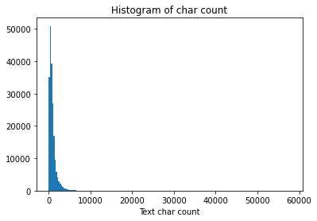
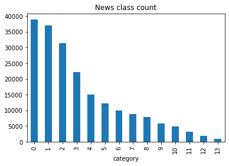

# Task02 数据读取与数据分析


```python
import os
print(os.getcwd())
```

    C:\Users\13398\Documents\GitHub\datawhale\NLP
    

## 数据读取


```python
import pandas as pd
train = pd.read_csv("./train_set.csv", sep='\t')
```


```python
train
```


<div>
<style scoped>
    .dataframe tbody tr th:only-of-type {
        vertical-align: middle;
    }

    .dataframe tbody tr th {
        vertical-align: top;
    }

    .dataframe thead th {
        text-align: right;
    }
</style>
<table border="1" class="dataframe">
  <thead>
    <tr style="text-align: right;">
      <th></th>
      <th>label</th>
      <th>text</th>
    </tr>
  </thead>
  <tbody>
    <tr>
      <th>0</th>
      <td>2</td>
      <td>2967 6758 339 2021 1854 3731 4109 3792 4149 15...</td>
    </tr>
    <tr>
      <th>1</th>
      <td>11</td>
      <td>4464 486 6352 5619 2465 4802 1452 3137 5778 54...</td>
    </tr>
    <tr>
      <th>2</th>
      <td>3</td>
      <td>7346 4068 5074 3747 5681 6093 1777 2226 7354 6...</td>
    </tr>
    <tr>
      <th>3</th>
      <td>2</td>
      <td>7159 948 4866 2109 5520 2490 211 3956 5520 549...</td>
    </tr>
    <tr>
      <th>4</th>
      <td>3</td>
      <td>3646 3055 3055 2490 4659 6065 3370 5814 2465 5...</td>
    </tr>
    <tr>
      <th>...</th>
      <td>...</td>
      <td>...</td>
    </tr>
    <tr>
      <th>199995</th>
      <td>2</td>
      <td>307 4894 7539 4853 5330 648 6038 4409 3764 603...</td>
    </tr>
    <tr>
      <th>199996</th>
      <td>2</td>
      <td>3792 2983 355 1070 4464 5050 6298 3782 3130 68...</td>
    </tr>
    <tr>
      <th>199997</th>
      <td>11</td>
      <td>6811 1580 7539 1252 1899 5139 1386 3870 4124 1...</td>
    </tr>
    <tr>
      <th>199998</th>
      <td>2</td>
      <td>6405 3203 6644 983 794 1913 1678 5736 1397 191...</td>
    </tr>
    <tr>
      <th>199999</th>
      <td>3</td>
      <td>4350 3878 3268 1699 6909 5505 2376 2465 6088 2...</td>
    </tr>
  </tbody>
</table>
<p>200000 rows × 2 columns</p>
</div>


```python
train.head()
```


<div>
<style scoped>
    .dataframe tbody tr th:only-of-type {
        vertical-align: middle;
    }

    .dataframe tbody tr th {
        vertical-align: top;
    }

    .dataframe thead th {
        text-align: right;
    }
</style>
<table border="1" class="dataframe">
  <thead>
    <tr style="text-align: right;">
      <th></th>
      <th>label</th>
      <th>text</th>
    </tr>
  </thead>
  <tbody>
    <tr>
      <th>0</th>
      <td>2</td>
      <td>2967 6758 339 2021 1854 3731 4109 3792 4149 15...</td>
    </tr>
    <tr>
      <th>1</th>
      <td>11</td>
      <td>4464 486 6352 5619 2465 4802 1452 3137 5778 54...</td>
    </tr>
    <tr>
      <th>2</th>
      <td>3</td>
      <td>7346 4068 5074 3747 5681 6093 1777 2226 7354 6...</td>
    </tr>
    <tr>
      <th>3</th>
      <td>2</td>
      <td>7159 948 4866 2109 5520 2490 211 3956 5520 549...</td>
    </tr>
    <tr>
      <th>4</th>
      <td>3</td>
      <td>3646 3055 3055 2490 4659 6065 3370 5814 2465 5...</td>
    </tr>
  </tbody>
</table>
</div>


- 赛题数据中，新闻的文本长度是多少？
- 赛题数据的类别分布是怎么样的，那些类别比较多？
- 赛题数据中，字符的分布是怎么样？

### 句子长度分析


```python
import numpy as np
import pandas as pd
```


```python
import matplotlib as plt
%pylab inline
train['text_len'] = train['text'].apply(lambda x : len(x.split(' ')))
train.head(10)
```

    Populating the interactive namespace from numpy and matplotlib
    

    C:\Users\13398\Anaconda3\envs\tensorflow\lib\site-packages\IPython\core\magics\pylab.py:160: UserWarning: pylab import has clobbered these variables: ['plt']
    `%matplotlib` prevents importing * from pylab and numpy
      "\n`%matplotlib` prevents importing * from pylab and numpy"
    


<div>
<style scoped>
    .dataframe tbody tr th:only-of-type {
        vertical-align: middle;
    }

    .dataframe tbody tr th {
        vertical-align: top;
    }

    .dataframe thead th {
        text-align: right;
    }
</style>
<table border="1" class="dataframe">
  <thead>
    <tr style="text-align: right;">
      <th></th>
      <th>label</th>
      <th>text</th>
      <th>text_len</th>
    </tr>
  </thead>
  <tbody>
    <tr>
      <th>0</th>
      <td>2</td>
      <td>2967 6758 339 2021 1854 3731 4109 3792 4149 15...</td>
      <td>1057</td>
    </tr>
    <tr>
      <th>1</th>
      <td>11</td>
      <td>4464 486 6352 5619 2465 4802 1452 3137 5778 54...</td>
      <td>486</td>
    </tr>
    <tr>
      <th>2</th>
      <td>3</td>
      <td>7346 4068 5074 3747 5681 6093 1777 2226 7354 6...</td>
      <td>764</td>
    </tr>
    <tr>
      <th>3</th>
      <td>2</td>
      <td>7159 948 4866 2109 5520 2490 211 3956 5520 549...</td>
      <td>1570</td>
    </tr>
    <tr>
      <th>4</th>
      <td>3</td>
      <td>3646 3055 3055 2490 4659 6065 3370 5814 2465 5...</td>
      <td>307</td>
    </tr>
    <tr>
      <th>5</th>
      <td>9</td>
      <td>3819 4525 1129 6725 6485 2109 3800 5264 1006 4...</td>
      <td>1050</td>
    </tr>
    <tr>
      <th>6</th>
      <td>3</td>
      <td>307 4780 6811 1580 7539 5886 5486 3433 6644 58...</td>
      <td>267</td>
    </tr>
    <tr>
      <th>7</th>
      <td>10</td>
      <td>26 4270 1866 5977 3523 3764 4464 3659 4853 517...</td>
      <td>876</td>
    </tr>
    <tr>
      <th>8</th>
      <td>12</td>
      <td>2708 2218 5915 4559 886 1241 4819 314 4261 166...</td>
      <td>314</td>
    </tr>
    <tr>
      <th>9</th>
      <td>3</td>
      <td>3654 531 1348 29 4553 6722 1474 5099 7541 307 ...</td>
      <td>1086</td>
    </tr>
  </tbody>
</table>
</div>


```python
train['text_len'].describe()
```


    count    200000.000000
    mean        907.207110
    std         996.029036
    min           2.000000
    25%         374.000000
    50%         676.000000
    75%        1131.000000
    max       57921.000000
    Name: text_len, dtype: float64


新闻平均句子的统计为907个字符，最短的句子长度为2，最长的为57921

## 根据句子长度绘制直方图


```python
fig1 = plt.hist(train['text_len'], bins=200) # bins参数：直方个数
plt.xlabel('Text char count')
plt.title("Histogram of char count")
```


    Text(0.5, 1.0, 'Histogram of char count')





## 新闻类别分布


```python
train['label'].value_counts().plot(kind='bar')
plt.title("News class count")
plt.xlabel("category")
```


    Text(0.5, 0, 'category')





在数据集中标签的对应的关系如下：{'科技': 0, '股票': 1, '体育': 2, '娱乐': 3, '时政': 4, '社会': 5, '教育': 6, '财经': 7, '家居': 8, '游戏': 9, '房产': 10, '时尚': 11, '彩票': 12, '星座': 13}

类别分布不均匀， 科技最多，星座最少

## 字符分布统计

统计每个字符出现的次数，首先可以将训练集中所有的句子进行拼接，进而划分为字符，统计每个字符的个数。


```python
from collections import Counter
```


```python
all_lines = ' '.join(list(train['text']))
word_count = Counter(all_lines.split(" "))
word_count = sorted(word_count.items(), key=lambda d:d[1], reverse = True)
```


```python
print(len(word_count))
print(word_count[0])
print(word_count[-1])
```

    6869
    ('3750', 7482224)
    ('3133', 1)
    

这里还可以根据字在每个句子的出现情况，反推出标点符号。下面代码统计了不同字符在句子中出现的次数，其中字符3750，字符900和字符648在20w新闻的覆盖率接近99%，很有可能是标点符号。


```python
from collections import Counter
train_df['text_unique'] = train_df['text'].apply(lambda x: ' '.join(list(set(x.split(' ')))))
all_lines = ' '.join(list(train_df['text_unique']))
word_count = Counter(all_lines.split(" "))
word_count = sorted(word_count.items(), key=lambda d:int(d[1]), reverse = True)

print(word_count[0])

print(word_count[1])

print(word_count[2])
```

### 数据分析的结论

通过上述分析我们可以得出以下结论：

赛题中每个新闻包含的字符个数平均为1000个，还有一些新闻字符较长；
赛题中新闻类别分布不均匀，科技类新闻样本量接近4w，星座类新闻样本量不到1k；
赛题总共包括7000-8000个字符；
通过数据分析，我们还可以得出以下结论：

每个新闻平均字符个数较多，可能需要截断；

由于类别不均衡，会严重影响模型的精度；

## 作业

- 假设字符3750，字符900和字符648是句子的标点符号，请分析赛题每篇新闻平均由多少个句子构成？
- 统计每类新闻中出现次数最多的字符？

1.多个分隔符来切分新闻


```python
import re
train['text_sentence'] = train['text'].apply(lambda x : re.split('3075|900|648', x))

train['text_sentence_count'] = train['text_sentence'].apply(lambda x : int(len(x)))
print(train['text_sentence_count'].describe())
```

    count    200000.000000
    mean         43.391820
    std          48.039958
    min           1.000000
    25%          15.000000
    50%          30.000000
    75%          55.000000
    max        1867.000000
    Name: text_sentence_count, dtype: float64
    

每篇新闻中平均有43个句子构成


```python
#统计每类新闻中出现次数对多的字符
from collections import Counter
category = {}
for i in range(len(train['label'])):   ##遍历所有内容，将字符按照label合并到一起 
    if train['label'][i] not in category:
        category[train['label'][i]] = train['text'][i]
    else:
        category[train['label'][i]] += ' '  #将字符加入该类别中 
        category[train['label'][i]] += train['text'][i]

category_count = {}
for key in category:
    word_count = Counter(category[key].split(' '))
    word_count = sorted(word_count.items(), key = lambda x:x[1], reverse = True)
    category_count[key] = word_count[0]
print(category_count)

```


```python

```


```python

```


```python

```


```python

```


```python

```


```python

```


```python

```


```python

```


```python

```


```python

```


```python

```


```python

```


```python

```
